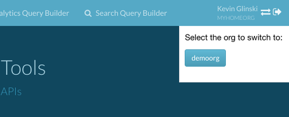

[Authorized organizations](https://help.mypurecloud.com/articles/about-authorized-organizations/) are a best practice when dealing with access to other organizations besides a user's home organization. A use case would be a Genesys partner who has their own PureCloud org but needs access to one of their customer's orgs to do setup and configuration. You can create a new user in the customer org for that person, but now they have to remember not only the password to the other organization but also the name of the organization and have to specify the name when logging in. 

## Logging in

When organization authroization is setup, the user will use their normal credentials but after logging in, they are presented with a list of organizations that they have access to and can select the organization from that list. This flow works both for the PureCloud app but also can be used in custom applications and this blog will walk through the steps that the custom application needs to take to handle it.

The process of logging in is exactly the same for authorized organizations as it is for a regular organization. The organization selected is part of the login process and is handled by PureCloud. After you initiate the OAuth flow, you end up with an access token that works with the organization the user selected during login.

## Validating organization
If you expand on the current user's organization information using [GET /api/v2/users/me?expand=organization](https://developer.mypurecloud.com/api/rest/v2/users/index.html#getUsersMe) the organization details will show the details for the organization the user selected on login. If you are restricting access in your application to specific organizations this might cause a problem because if you expect only users from the partner organization to log in you'll get the id of the customer organization now. To determine if the user is logged into an organization that isn't their home organization, you will now want to expand on _token_ details for the user ```GET /api/v2/users/me?expand=organization,token```

The token details will look similar to 

```{"language":"json"}
"token": {
    "organization": {
      "id": "2a3a43e5-e89c-406e-badf-e79288bd4ab0",
      "name": "customerorgname"
    },
    "homeOrganization": {
      "id": "4b70ee8c-24d8-43ad-9464-520f6b20fa1f",
      "name": "partnerorgname"
    },
    "OAuthClient": {
      "id": "08a2a69c-1ed5-4719-9094-96a7d55ba07c",
      "name": "MyCustomAppName",
      "organization": {
        "id": "4b70ee8c-24d8-43ad-9464-520f6b20fa1f"
      }
    }
  },
```

Here you can see that organization and home organization have different values, if I were logged into my home organization the values would be the same. These details can be used to validate if the user has access to your application, instead of using organization.id, you can use token.homeOrganization.id to validate your user's organization.

## Switching back to home organization

When logged into an organization that isn't the user's home org, you might want to provide the option to switch back to their home organization. This is done in both the PureCloud client and Developer Tools by providing a button in the top right corner to switch.


Here in the Developer Tools, we show clearly that the user is not logged into their home organization and then provide the home button to switch them back to their home organization.

This switch is done by doing a browser redirect back to _login.<purecloudenvironment>.com_ and specifying in the query string ```target=<homeorgid>``` 

```https://login.${env}/oauth/authorize?client_id=${oauthConfig.clientId}&response_type=token&redirect_uri=${oauthConfig.redirect}&target=${me.token.homeOrganization.id}```

## Organization switching in practice

[This commit](https://github.com/MyPureCloud/developer-tools/commit/4be0f43901ee32e0f8aaec0e949b468f7891f2ef) to Github is where switching was added to the Developer Tools.

The two key points here are where we check if we are in a trusted org in ```app/components/header-bar.js```

```{"language":"js"}
isInTrustedOrg: computed('purecloud.me', function() {
    let me = this.get('purecloud').get('me');
        if(!me){
        return false;
    }
        if(me.token && me.token.organization && me.token.homeOrganization){
        return me.token.organization.id !== me.token.homeOrganization.id;
    }    
    
    return false;
}),
```

and then in the same file where we switch back to the home org

```{"language":"js"}
switchToHomeOrg(){
    let oauthConfig = config.oauthProps[purecloudEnvironment()];
        let env = purecloudEnvironmentTld();
    let me = this.get('purecloud').get('me');
        let redirect = `https://login.${env}/oauth/authorize?client_id=${oauthConfig.clientId}&response_type=token&redirect_uri=${oauthConfig.redirect}&target=${me.token.homeOrganization.id}`;

    window.location.replace(redirect);
}	        
```

## Taking it a step further

So far, we have reproduced the functionality in the PureCloud client where when we log in we can select the organization we want to use and if we aren't in our home organization we can switch back to it. That got me wondering, if we are in our home organization, can we use the same logic to switch into a trustor organization? This took a couple iterations to get the right API call to use, first I found ```GET /api/v2/orgauthorization/trustees``` but that required a permission of ```authorization:orgTrustee:view``` in the home organization and didn't list the users who were actually part of a trust so could list trusts that my user didn't have access to. Then I looked at ```GET /api/v2/orgauthorization/trustors/{trustorOrgId}/users``` which would give me the list of trusted users in an organization, but that API call requires the ```authorization:orgTrusteeUser:view``` permission in the trustor organization, which even in my dev setup I didn't have. So I had to look beyond the Organization Authorization category and found ```GET /api/v2/users/{userId}/trustors``` which I figured would work if I used my own user's id, but that required the ```authorization:orgTrustor:view``` permission which my users might or might not have. Finally I remembered the trusty old ```GET /api/v2/users/me``` which conviently has a ```trustors``` expands on it so calling ```GET /api/v2/users/me?expand=trustors``` will give me the organizations which have trusted my user. Now I can use that call which happens when the Developer Tools bootstraps and determine my trusts from there

```{"language":"js"}
getTrustedOrgs: Ember.observer('purecloud.me', function() {
    this.orgTrusts.clear();

    let me = this.get('purecloud').get('me');

    if(!me || !me.trustors){
        return false;
    }
    
    me.trustors.forEach((trust)=>{
        if(trust.enabled){
            this.orgTrusts.pushObject(trust.organization);
        }
    });

    this.set("isTrustedOrg", me.trustors.length > 0);
            
})
```

Now when my user is logged into their home organization, I can provide a list of buttons to switch into an org they are trusted.



The move to add this logic happened in a couple of commits, but the end result is that everything is encapsulated in a single service which can be found [here](https://github.com/MyPureCloud/developer-tools/blob/master/app/services/orgauthorization-service.js). Hopefully now you have a better understanding of organization authorization and how to put that logic into your own application.
