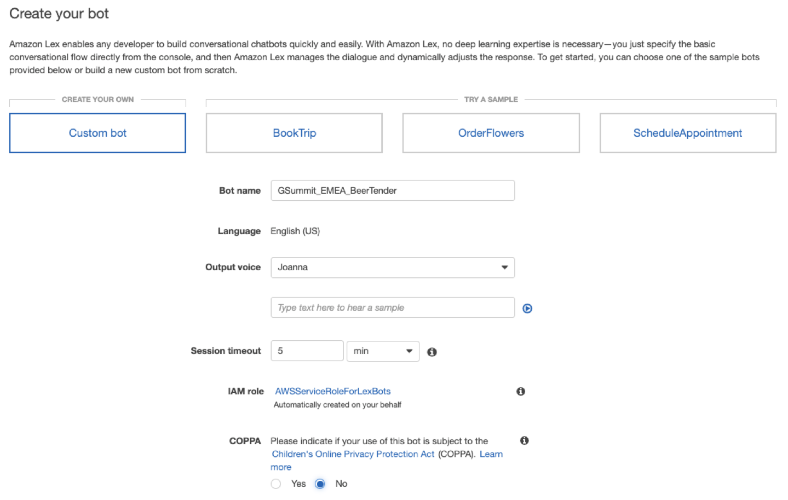
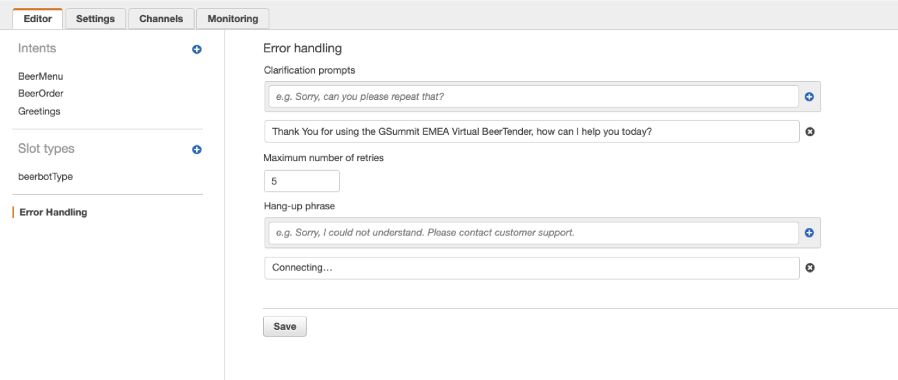
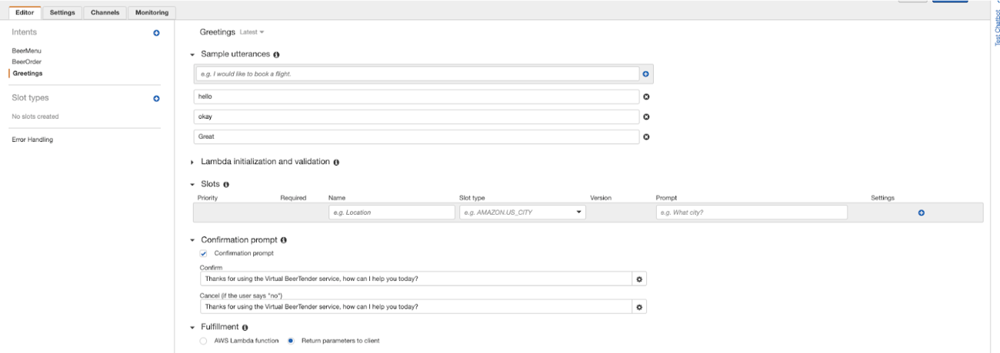
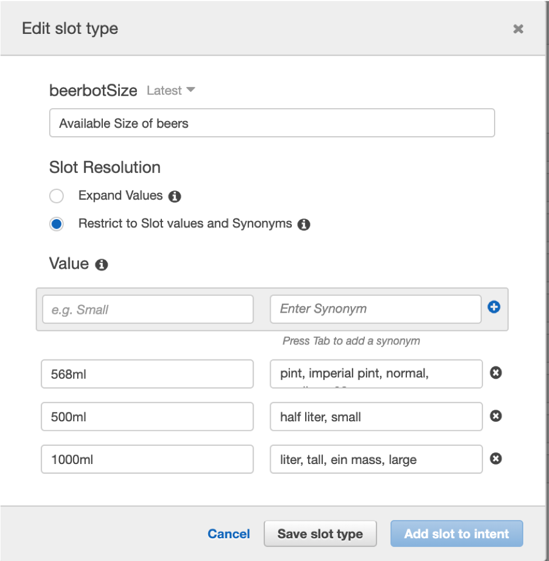
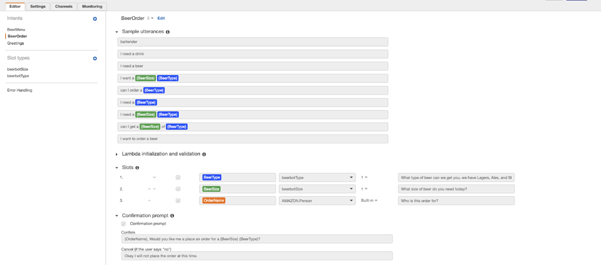
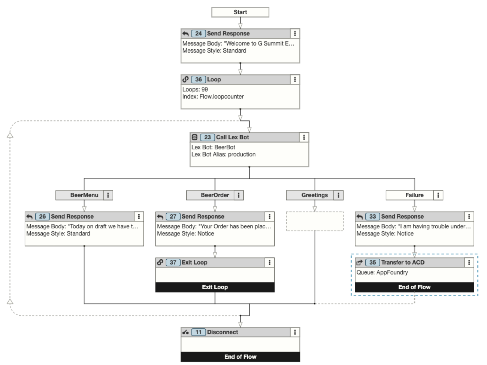
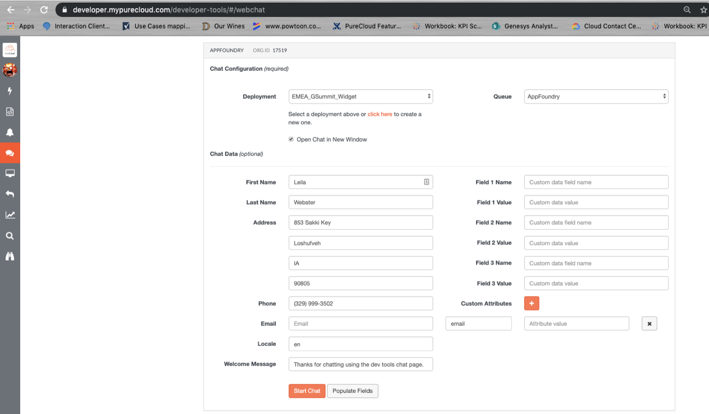

Since we released our PureCloud and Amazon Lex integration last year we have spent a lot of time with customers to explain the integration, talking about about how to best use the technology to solve their use cases, and honestly helping dispel the myths around the technology.  We decided for our Genesys EMEA G-Summit conference this year we wanted to show how easy it is to create a chatbot that could take a simple drink order in PureCloud integrated with a bot built with Amazon Lex. What better way to showcase this than to build a bot that would help expedite ordering a nice frosty beverage at the end of a long day.

[toc]
 
Example customer-to-bot conversation use case to discover the beers available and place an order:

::: 
**BeerTender:** Welcome to G Summit EMEA! I'm your virtual bartender PureTender. Can I get you a beer?

**Customer:** Hello

**BeerTender:**  Thanks for using the Virtual BeerTender service, how can I help you today?

**Customer:** I need a beer

**BeerTender:** What type of beer can we get you, we have Lagers, Ales, and Stouts?

**Customer:** what lagers do you have?

**BeerTender:** Today on drafter we have the following beers: Lager from Heinenken, Brown Ale from New Castle, and a Stout from Guinness. Can I get you any of these from the bar?

**Customer:** can I get the lager

**BeerTender:** Sure, what size of beer do you need today?

**Customer:** a pint

**BeerTender:** Who is this order for?

**Customer:** Jack

**BeerTender:** Jack, Would you like me to place an order for a 568ml Lager?

**Customer:** Yes!

**BeerTender:** Your Order has been placed with the bar, give us 5 minutes and it should be ready.
:::

:::primary
**BeerTender Chatbot Demo**

Click the button to chat with the BeerTender now!

<button onclick="chatnow()" class="btn btn-primary">Chat with BeerTender</button>
:::

## Workshop Steps

Part 1 - Setting up the Amazon Lex Bot
* In part 1 we will utilize Amazon Lex to build a simple chatbot that will take inbound chat requests and identify if the intent of the request information or order for routing. From there we will collect the needed customer information to place the order.

Part 2 - Integrating your Amazon Lex bots into your PureCloud organization
* In Part 2 we will learn how to integrate Amazon Lex with PureCloud for use in architect flows. 

Part 3 - Setting up the PureCloud Inbound SMS Flow
* In Part 3 we will setup an inbound PureCloud Chat flow integrated with your Lex bot for inbound message processing.

Future Part 4 -  Ways to expand the logic and use case - New Blog Coming Soon.

### Part 1 - Amazon Lex Bot Setup

To setup your Amazon Lex bot for this workshop you will need to login to your AWS account via the the [AWS Admin console](https://console.aws.amazon.com/console/home).

 Create the new bot your Amazon Web Services account.
* Login to your Amazon services console
* Open the Amazon Lex service console
* From the Amazon Lex console, create a Custom bot with these settings (you can see these in the "Settings" tab later)

| Setting | Value |
| ------ | ------ |
| Bot Name | GSummit_EMEA_BeerTender |
| Output Voice | Joanna |
| Session Timeout | 5 minutes |
| IAM Role | Accept the Default AWSServiceRoleForLexBots |
| COPPA | NO |

### Part 2 - Error Handling

Update the bots Error handling settings to something more human friendly.

* Make sure you are on the "Editor" tab and navigate to the "Error Handling" settings.
* Clarification prompts: **Thank You for using the GSummit EMEA Virtual BeerTender, how can I help you today?**
* Maximum number of retries: **1**
*  Hang-up phrase: (one phrase) **Connecting…**

### Part 3 - Bot Aliases

Set up the bot Aliases to support a development and product bot version

* Click on the "Settings" tab for your bot.
*  Setup the following two Aliases

| Alias Name | Bot Version |
| ------ | ------ |
| Development | Latest |
| Production | Latest |

### Part 4 - Create Intents

Now it’s time to create our intents for the bot, for this we will create 3 main intents for the bot

* **Greetings** – _We will use this for the common greetings that people will send to ensure the bot does hit error paths due to common courtesy responses._
* **BeerOrder** – _Once a customer knows what beer they want this will allow them to order a beer and send the captured data to the bar._
* **BeerMenu** – _For customers wanting to get a listing of the beer options._

#### Greetings Intent
 
1. Next to Intent click the (+) and when prompted click on "create intent".
2. When asked to name your intent you should name it "Greetings"
3. This will provide you with a new blank intent for Greetings for you to setup Sample utterances to help the NLU identify phrases that would help identify the when a user should hit the Greetings intent.
4. For the Sample utterances we will want to populate 10+ common greeting utterances for the best results. Below is a table of 10 you can add, but you can add additional ones.

| Utterances | Utterances | Utterances |
| ------ | ------ | ------ |
| Thank You | Thanks | Good Morning |
| Morning | Afternoon | Good Afternoon |
| Evening | Good Evening | Welcome |
| Ok | Okay | Hello |
| Help | Great | Cool |
| Fantastic | Thx | TY |
 
5. We will want to setup a confirmation prompt to respond back to the user if we capture a greeting. We will:

	* Check the box for **"Confirmation prompt"**
	* Confirm: **Thanks for using the Virtual BeerTender service, how can I help you today?**
	* Cancel: **Thanks for using the Virtual BeerTender service, how can I help you today?**

6. Lastly you will want to click on the "Save Intent" at the bottom of the screen to ensure you save all of the configuration you just set up.
 

 
#### BeerOrder Intent
 
1. Next to Intent click the (+) and when prompted click on "create intent".
2. When asked to name your intent you should name it "BeerOrder"
3. This will provide you with a new blank intent for BeerOrder for you to setup sample utterances to help the NLU identify phrases that would help identify the when a user should hit the BeerOrder intent.
4. For the Sample utterances we will want to populate 10+ common ordering utterances for the best results. Below is a table of 12 you can add, but you can add additional ones.

| Utterances | Utterances | Utterances |
| ------ | ------ | ------ |
| bartender | I need a beer | I need a drink |
| I need a {BeerType} | I want a beer | I want a drink |
| I want a {BeerType} | I want a {BeerSize} {BeerType} | Can I order a beer |
| Can I order a {BeerType} | Can I get a {BeerType} | Can I get a {BeerSize} of {BeerType} |

5. For this Intent we will want to capture some custom information from the customer so we can utilize the information on the utterances and so we can capture the order information. For this click on the (+) next to "Slot types" on the left menu
6. Select the "Create slot type" option.
7. We are going to create two custom slots for the beer size and beer type. Enter the information below into the Add slot type configuration screen:

	* Slot type name: **beerbotType**
	* Description: **The available types of beers you can order**
	* Slot Resolution: **Restrict to Slot values and Synonyms**
	* Value: **Lager**
	* Synonym: **lagers, light, pilsner, belgium**
	* Click the plus
	* Value: **Ale**
	* Synonym: **ales, brown, ipa, sour, wild**
	* **Click the (+)**
	* Value: **Stout**
	* Synonym: **stouts, irish, porter, oatmeal**
	* **Click the (+)**

8. Click the "Add slot to Intent" to save the slot and add it to the current Intent.

9. Repeat 6-8 for the beer size slot with the information below:

	* Slot type name: **beerbotSize**
	* Description: **The available sizes of beers you can order**
	* Slot Resolution: **Restrict to Slot values and Synonyms**
	* Value: **500ml**
	* Synonym: **small, half**
	* **Click the (+)**
	* Value: **568ml**
	* Synonym: **pint, imperial, normal, standard, 20oz**
	* **Click the (+)**
	* Value: **1000ml**
	* Synonym: **liter, tall, ein mass, large**
	* **Click the (+)**

10. This will have added the two slots to your Intent "Slots" with some defaults that we need to update. For each of the slots update the information to the following:

	* Priority: **1**
	* Required: **Checked**
	* Slot Name: **BeerType**
	* Slot Type: **beerbotType**
	* Slot Prompt: **What type of beer can we get you, we have Lagers, Ales, and Stouts?**
	* Priority: **2**
	* Required: **Checked**
	* Slot Name: **BeerSize**
	* Slot Type: **beerbotSize**
	* Slot Prompt: **What size of beer do you need today, we can do pints and more?**

11. Next, we are going to add another slot for the OrderName that will use a built-in Amazon slot type:

	* Priority: **3**
	* Required: **Checked**
	* Slot Name: **OrderName**
	* Slot Type: **AMAZON.Person**
	* Slot Prompt: **Who is this order for?**

12. Now to finish out this intent we want to setup a "Confirmation prompt" that will confirm the order with the user before we pass it back to PureCloud.
	* Confirmation prompt: **Checked**
	* Confirm: **{OrderName}, Would you like me a place an order for a {BeerSize} {BeerType}?**
	* Cancel: **Okay I will not place the order at this time.**
13. Lastly you will want to click on the "Save Intent" at the bottom of the screen to ensure you save all of the configuration you just setup.

#### BeerMenu Intent
 
1. Next to Intent click the (+) and when prompted click on "create intent".
2. When asked to name your intent you should name it "BeerMenu"
3. This will provide you with a new blank intent for BeerMenu for you to setup sample utterances to help the NLU identify phrases that would help identify when a user should hit the BeerMenu intent.
4. For the Sample utterances we will want to populate 10+ common menu request utterances for the best results. Below is a table of 10 you can add, but you can add additional ones.

| Utterances | Utterances | Utterances |
| ------ | ------ | ------ |
| what beers do you have | what are my options | what do you have on draft |
| what do you have in the bottle | what {beerbotType} do you gave  | tell me what you have |
| what are my beer options | do you have any {beerbotType} | what is your menu |

5. Since we are using a dynamic slot in the utterance we need to add the Slot to the Intent, but since we don't want to capture the information for this example we will not make it required.

	* Priority: **1**
	* Required: **UnChecked**
	* Slot Name: **beerbotType**
	* Slot Type: **beerbotType**
	* Slot Prompt: **None**

6. Lastly you will want to click on the "Save Intent" at the bottom of the screen to ensure you save all of the configuration you just setup.

 

## Building and Publishing Your Bot

To finalize our bot for use by PureCloud we are going to need to build the bot and publish it under one of the aliases you created. This is very easy, but it's important to remember when you publish to an alias this will be the bot that anything referring that alias will now use.

### Part 1 - Build the Bot

To Publish you will first need to build the bot. In the top right of your AWS console for the bot you will be a "Build" button. When clicked another pop-up will come up and you will need to click on the "Build" again. Once the bot is done building it will alert you in the UI. 

After a bot is done building I always advise to do some testing with the bot and send some common phrases in to ensure that I did not input anything incorrectly. 

If everything looks to be in order it is now time to publish your bot for use. In the top right of your AWS console for the bot you will be a "Publish" button. When clicked another pop-up will come up and you will need to select the alias you with to publish the bot to. For this workshop you will want to use the "development" alias. Once you have selected this click on the "Publish" button again. Once the bot is done publishing it will alert you in the UI. 

### Part 2 -  Integrating your Amazon Lex bots into your PureCloud organization

To learn more about integrating your Amazon Lex bots with PureCloud you can go to [Integrating PureCloud with Amazon Lex](https://help.mypurecloud.com/articles/about-the-amazon-lex-integration/)

### Part 3 - Setting up the PureCloud Inbound Chat Flow

#### Log in to PureCloud and setup your user skills for the lab

For this part first we need to access your PureCloud organization that we will build the new Chat flow in, login to PureCloud by navigating in a chrome browser to your regional login, (login.mypurecloud.ie), (login.mypurecloud.de), (login.mypurecloud.com).

#### Access PureCloud Architect flow builder to start building our new flow.

1. We need to now launch Architect and get to the Inbound Chat Flows.

	* Click on the "Admin" menu at the top of the screen
	* In the admin screen search for "Architect" to find the architect tool link and click on it when it comes up.
	* This will launch a new browser tab with PureCloud architect running in it.
	* Once in Architect move your cursor over to the top left of the menu over the "Flows" menu and click on the "Inbound Chat" to navigate to the inbound message flows.

2. Click on the "+ Add" to create a new chat flow. You can give the flow any name you wish, I will use VirtualBeerTender for this example.
3. Build your flow. The Architect Flow that integrates with your Lex Bot will look like this when finished:

**Below I will define the configuration of each of the Task elements by the Element# in the screenshot.**

**24 Send Response:** Here we will send a welcome greeting to the customer when they first open the chat window.
* Message Style: **standard**
* Message Body: **"Welcome to G Summit EMEA! I'm your virtual bar tender PureTender. Can I get you a beer?"**

**36 Loop:** We will insert a loop that will allow us to continue to put the customer back into the bot until they exit or complete the order.
* Loop Count: **99**
* Current Index Data Name: **Flow.loopcounter**

**23 Call Lex Bot:** We will invoke the bot at this point within the loop to send the customer chat to the bot.
* Follow-up Response Timeout: **5 minutes**
* Bot Name: **GSummit_EMEA_BeerTender**
* Bot Alias: **development**
* BeerType: **flow.beertype**
* BeerSize: **flow.beersize**
* OrderName: **flow.ordername**

**26 Send Response:** We will be sending a list of the menu back to customers that have hit the BeerMenu intent in the bot.
* Message Style: **standard**
* Message Body: **"Today on draft we have the following beers:- Lager from Heinenken - Brown Ale from New Castle - Stout from GuinnessCan I get you any of these from the bar?"**

**27 Send Response:** We will confirm the order has been placed with the beer when the BeerOrder intent has been completed
* Message Style: **notice**
* Message Body: **"Your Order has been placed with the bar, give us 5 minutes and should be ready"**

**37 Exit Loop:** Since the BeerOrder intent has been completed we will exist the order loop

**33 Send Response:** If the bot failed due to problems invoking or failed due to not being able to understand.
* Message Style: **notice**
* Message Body: **"I am having trouble understanding your order, hold just a second for a live bartender"**

**35 Transfer to ACD:** Since the bot failed we will handoff to a live agent.
* Queue: **Choose your Queue to send to humans.**

**11 Disconnect:** End the flow

4. Once you are done make sure to save and publish your chat flow.

### Part 4 - Create your chat widget

1. We need to open the Widgets menu in the PureCloud admin.

	* Click on the "Admin" menu at the top of the screen
	* In the admin screen search for "Widgets" to find the widgets menu link and click on it when it comes up.

2. Click on the "(+) Create Widget" to setup a new web widget for the BeerTender chatbot and configure it with the following information:

	* Widget Name: **BeerTender**
	* Description: **This is the web widget that will be associated with our virtual beer ordering bot**
	* Widget Type: **Version 1.1**
	* Chat Appearance: **Modern**

3. Click "Save"

### Part 5 - Testing the Chatbot with PureCloud Developer Tools

To test out your chatbot experience before deploying it to your website you can use the PureCloud Developer Center Tools at [Developer-Tools Webchat](https://developer.mypurecloud.com/developer-tools/#/webchat)

### Part 6 - Deploy the Chat to your Website

For examples on how to deploy the chat to a website see the detailed instructions and options located on the Developer Center at [Deploying Webchat](https://developer.mypurecloud.com/api/webchat/)

