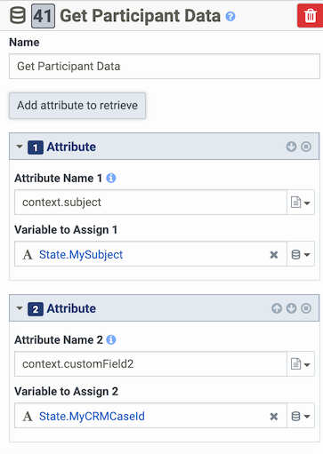
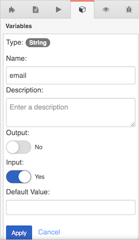
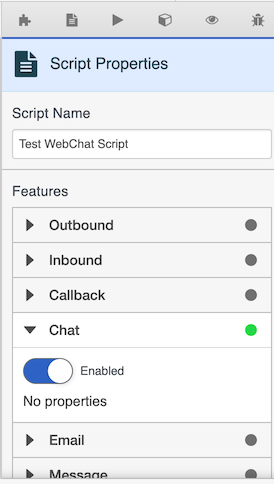

When you expose chat capability on your web site, you can collect data about your customer and send that information to Genesys Cloud. This data can then be leveraged in your *Architect Inbound Chat flow*, to make routing decisions.  This data can also be exposed as [Interaction Details](https://help.mypurecloud.com/articles/view-interaction-details-chat-interaction/) or in an agent [script](https://help.mypurecloud.com/articles/about-scripting/), to provide a better context to the Contact Center agent.  In this blog, I will explain how to retrieve and to leverage that data on the Genesys Cloud side.  Specifically, I will demonstrate this by using [Chat v2 and the built-in widget version 2](/api/webchat/widget-version2.html). Let's review the different ways to collect and to send data using the V2 chat widget.

**Collect and send data:**
To collect data from a customer, you can either use the standard Chat Registration form (which collects `firstname`, `lastname`, `email` and `subject` using a predefined form), or define a [custom Registration Form](https://all.docs.genesys.com/WID/Current/SDK/WebChat-combined#Customizable_chat_registration_form). The purpose of these forms are to expose input you want to collect from the customer through different types of input fields (e.g. text, drop-down, checkbox,  ect...) along with different attributes. (e.g. name, email, subject/reason, etc..) 

You can also send "static" data sent as `userData`. Static data is data that you do not need to expose directly to the customer and collecting via input fields. (text, drop-down, ...) This data could be coming from your backend. An example of static data could include things like customer address or customer account information. This data is anything you retrieve from the customer's browsing history or from the customer's account (in your backend). The `userData` structure can be defined in the [widgets configuration](/api/webchat/widget-version2.html#custom__userdata_). It can also be set in the [WebChat.open command as a parameter](https://all.docs.genesys.com/WID/Current/SDK/WebChat-combined#open) (if you are using this method to open and to start a chat)

The data you collected in the Chat Registration form (standard or custom) and the data you defined as `userData` (if any) will be sent to Genesys Cloud, as part of the create chat request, and will be added as participant attributes on the customer participant in the conversation context.

**Understand relationship between Widget v2 attributes and Genesys Cloud Conversation Participant attributes:**

There are two things which you should be aware of:

1.	**If you use "key1" as attribute name (as part of a registration form or as userData), this piece of data will become a participant attribute named "context.key1".** When the chat is created, Genesys Cloud (server/cloud side) automatically prepends chat attribute names with "context.".
Therefore, if you retrieve the conversation context (ex: using [Conversations API to get the conversation](/api/rest/v2/conversations/#get-api-v2-conversations--conversationId-), or using an [Analytics asynchronous job to get conversation details](/api/rest/v2/conversations/#post-api-v2-analytics-conversations-details-jobs)), you will find these key/value pairs, starting with "context." prefix, under the participant attributes on the customer participant.

**Note:** For the [Analytics Query for Conversation Details (synchronous)](/api/rest/v2/conversations/#post-api-v2-analytics-conversations-details-query), the query for conversation details does not bring back participant attributes. If you want to use an analytics query to retrieve information on conversations and you want to get the participant attributes as well, you must use the asynchronous job.

2.	**When using the custom Registration form with a set of fields, the "name" attribute of the field is what will be used to define the keyname of your participant data.** If you use the custom registration form defined [here as an example](/api/webchat/widget-version2.html#customize_input_fields_through_configuration_object), it means that "firstname", "Page", "Today" will be used. And my my participant attributes (Genesys Cloud conversation) will be: `context.firstname`, `context.Page`, `context.Today`

## Keynames of the Standard Chat Registration Form:
If you use the standard Chat Registration form, four input fields are exposed: `FirstName`, `LastName`, `Email`, and `Subject`. The corresponding widget v2 attribute names (keynames on the Widget v2 side) are the following: `firstname`, `lastname`, `email`, `subject`. With the "context." prefix added by Genesys Cloud, they will become participant attributes named: `context.firstname`, `context.lastname`, `context.email` and `context.subject`.

## Built-In Widget v2 - Underneath:
Whether you use a Standard Chat Registration form, or a Custom Chat Registration form, the built-in widget version 2 also automatically collects and sends the following data.

In the Genesys Cloud Conversation, you can find these additional participant attributes:
* "context._genesys_OS" - operating system of the customer - ex: "Mac OS X",
* "context._genesys_browser" - web browser used by the customer - ex: "Chrome",
* "context._genesys_source" - device used by the customer - ex: "web"
* "context._genesys_url" - url of the page where the Chat was started
* "context._genesys_pageTitle" - title of the page where the Chat was started
* "context._genesys_referrer" - value of the [HTTP Referrer header](https://developer.mozilla.org/en-US/docs/Web/HTTP/Headers/Referer) (if any)

Also, if you set a `Queue` as a `targetAddress` in your [widget configuration](/api/webchat/widget-version2.html#create_a_widget_configuration_object), the following participant data will become to you in your architect inbound chat flow: `context.genesys.legacyRoutingTargetQueueAddress`.  If you want to leverage this input in your Transfer to ACD action, you will first need to transform the retrieved queue name into a Queue object/variable.  See the [using Find Queue action](https://help.mypurecloud.com/articles/find-queue-action/) documentation for more details.

We have walked through a description of what attributes can be added.  Lets actually look at the what the conversation service (e.g. GET /api/v2/conversations/{my_conversation_id}) returns to us when these attributes have been added.

```json
{
  "id": "my_conversation_id",
  "startTime": "2021-01-20T09:25:34.532Z",
  "endTime": "2021-01-20T09:32:03.940Z",
  "participants": [
    {
      "id": "my_customer_participant_id",
      "startTime": "2021-01-20T09:25:34.532Z",
      "endTime": "2021-01-20T09:32:02.388Z",
      "connectedTime": "2021-01-20T09:25:34.532Z",
      "name": "Blanche Stokes",
      "queueId": "my_queue_id",
      "queueName": "CXService",
      "purpose": "customer",
      "wrapupRequired": false,
      "attributes": {
        "context.email": "customer.email@domain.com",
        "context.addressPostalCode": "24667",
        "context.customerId": "123456",
        "context.customField1Label": "Reason",
        "context._genesys_OS": "Mac OS X",
        "context._genesys_browser": "Chrome",
        "context.phoneType": "Cell",
        "context._genesys_referrer": "https://developer.mypurecloud.ie/",
        "context.addressStreet": "75 Dolgel Circle",
        "context.phoneNumber": "(938) 679-8637",
        "context._genesys_source": "web",
        "context.customField2Label": "CRM CaseId",
        "context.addressCity": "Uzicomnov",
        "context.genesys.legacyRoutingTargetQueueAddress": "CXService",
        "context.firstName": "Blanche",
        "context.customField2": "my case id in crm",
        "context.lastName": "Stokes",
        "context.subject": "Test subject",
        "context._genesys_url": "https://developer.mypurecloud.ie/developer-tools/#/webchat",
        "context.addressState": "WV",
        "context._genesys_pageTitle": "Developer Tools",
        "context.customField1": "Upgrade my internet subscription"
      },
      "calls": [],
      "callbacks": [],
      "chats": [
        {
          "state": "disconnected",
          "id": "my_chat_id",
          "segments": [
            {
              "startTime": "2021-01-20T09:25:34.532Z",
              "endTime": "2021-01-20T09:32:02.388Z",
              "type": "Interact",
              "howEnded": "Disconnect",
              "disconnectType": "peer"
            }
          ],
          "held": false,
          "direction": "inbound",
          "disconnectType": "peer",
          "connectedTime": "2021-01-20T09:25:34.539Z",
          "disconnectedTime": "2021-01-20T09:32:02.388Z",
          "provider": "PureCloud Webchat v2",
          "afterCallWorkRequired": false
        }
      ],
      "cobrowsesessions": [],
      "emails": [],
      "messages": [],
      "screenshares": [],
      "socialExpressions": [],
      "videos": []
    },
    {
      ...
    },
    {
      ...
    },
    {
      ...
    }
  ],
  "recordingState": "NONE",
  "divisions": [
    {
      ...
    }
  ],
  "selfUri": "/api/v2/conversations/my_conversation_id"
}
```

## Keynames meaningful to Interaction Details:
There are a set of keynames which are specifically interpreted in the [interaction details panel](https://help.mypurecloud.com/articles/view-interaction-details-chat-interaction/) for a chat conversation or in an agent [script](https://help.mypurecloud.com/articles/about-scripting/):

* firstname
* lastname
* email
* addressStreet
* addressCity
* addressPostalCode
* addressState
* phoneNumber
* phoneType
* customerId

In addition the following interaction detail attributes are exposed:
* customField1Label
* customField1
* customField2Label
* customField2
* customField3Label
* customField3

The interaction details for a chat conversation will also expose additional attributes including:
* Customer Name: based on firstname and lastname
* Customer Address: based on addressStreet, addressCity, addressPostalCode and addressState
* Customer Phone Number: based on phoneNumber and phoneType
* Customer Email: based on email
* Customer ID: based on customerId

You can also expose up to 3 custom entries, using the customField attributes listed above. In order to do so, you must define the label of that entry (ex: customField1Label) and the corresponding value (ex: customField1). Using the Conversation Context displayed above, this would look like this.


## Retrieve chat attributes in an Architect Inbound Chat flow:
You can access all of these data using a [Get Participant Data action](https://help.mypurecloud.com/articles/get-participant-data-action/) and using the `context.<<your keyname>>` as the attribute name.



## Using agent scripts
An agent [script](https://help.mypurecloud.com/articles/about-scripting/) is a much better approach to display information to a contact center agent, compared to the interaction details. With an agent script, you are not limited to a specific set of keynames (unlike with interaction details). Instead, you can retrieve and expose any of the collected chat data. Agent scripts offers two ways to retrieve data attributes:

1.	Using [Script built-in variables for chat](https://help.mypurecloud.com/articles/built-in-script-variables/)
2.	Using [Script variables](https://help.mypurecloud.com/articles/add-script-variable/)

### Using Script built-in variables for chat
The [Script built-in variables](https://help.mypurecloud.com/articles/built-in-script-variables/) approach relies on specific chat attributes (same than with interaction details). There is one exception to be aware of, the `customer email` built-in variable.  This variable is not supported with Chat v2.  Instead you will have to use the script variables approach if you want access to this information.

|Script built-in variable |Widget v2 attribute | Conversation Participant Attribute|
|-------------------------|------------------- |-----------------------------------|
{{Chat.Customer Email}}   | Not supported      | Not supported 
{{Chat.Customer First Name}} | firstname | context.firstname 
{{Chat.Customer Last Name}} | lastname | context.lastname 
{{Chat.Customer Street}} | addressStreet | context.addressStreet 
{{Chat.Customer City}} | addressCity | context.addressCity 
{{Chat.Customer Postal Code}} | addressPostalCode | context.addressPostalCode 
{{Chat.Customer State}} | addressState | context.addressState 
{{Chat.Customer Phone Number}} | phoneNumber | context.phoneNumber 
{{Chat.Customer Phone Type}} | phoneType | context.phoneType 
{{Chat.Customer ID}} | customerId | context.customerId |  | 

### Using Script variables
You can get all of this data, including `email` and other custom chat attributes, by defining a [script variable](https://help.mypurecloud.com/articles/add-script-variable/), with  the `Input toggle/property` enabled. This means that when the script loads, the agent script will extract participant attributes with the corresponding variable `Name` from the conversation context and store their value in the script variable.

**Important:**
Agent scripts do not support Attribute Names with a "." (dot). So when it is a chat conversation, Script automatically/internally adds the "context." prefix. This means that if you want to retrieve these values, define a variable with the input toggle enabled and variable `Name`,`email`,`subject`, \_genesys\_pageTitle




**Don't forget to enable Chat in your Script Properties!**



## Closing Thoughts
This article was written in response to the number of questions we get from our developers who are building with the v2 Chat components and APIs. In first quarter of this year, Genesys Cloud launched their next generation Web Messaging platform in beta. This new Web Messaging platform is going to be the go forward solution we recommend our customers look at for building user-to-agent chat capabilities within their own applications. We will continue to support the chat V2 widget and APIs, but Genesys Cloud will not be building any new capabilities into the Chat V2 widget or API. Please visit our [developer center](https://developer.mypurecloud.com/api/webmessaging) for more information on our Web Messaging platform.
