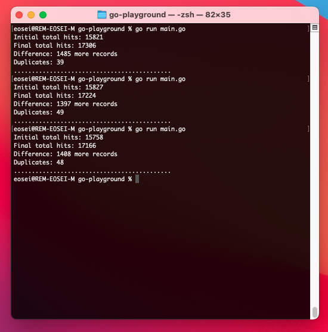

Greetings everyone! `POST /api/v2/analytics/conversations/details/query` is a useful API endpoint for viewing or monitoring conversations details in an organization. It offers the ability to query conversations extensively based on desired metrics. Due to the nature of conversation data, the endpoint's responses may seem to act unusual sometimes. ​​In this article, I will describe the irregular behavior of the endpoint and also suggest ways you can make effective API calls.

For more information about the conversation details query endpoint, checkout the [conversations details query documentation](/analyticsdatamanagement/analytics/detail/) on the developer center.

## The Apparent Inconsistency of the Conversation Details Query Endpoint

When querying the `POST /api/v2/analytics/conversations/details/query`, the totalHits counter reflects the total approximate number of matching conversations for the given query body. If the interval covers a date span that contains data that’s receiving new traffic from an organization, the totalHits counter can be a constantly changing value due to data continuously being fed into the backend in real time. Consequently, if paging through result sets for an interval is necessary, deduplication of the results could be required as the contents of early pages could arrive on a subsequent page pull due to the data set continually updating. Every API request made reflects data the system is aware of at the moment the request was made. When querying an interval that is receiving new information, the totalHits count and contents of particular pages will change along with that new data.

To receive data in realtime, we recommend utilizing the [Notification Service](/notificationsalerts/notifications/) by consuming data from EventBridge or WebSocket [topics](/notificationsalerts/notifications/available-topics) where applicable.

## Demonstration of API behavior

To give a brief demonstration about the behavior, I have a simple code snippet that calls the conversation detail query endpoint to collect the mean opinion score(MOS) of conversations from 10 minutes ago. [MOS](/analyticsdatamanagement/analytics/detail/call-quality#mean-opinion-score--mos-) is basically a measure of audio quality at a specific measurement point of a voice interaction.

```go
func getMos() {
	pageNumber := 1

	//Maximum number of records per page
	pageSize := 200

	currentTime := time.Now()

	//interval for past 10 minutes
	interval := fmt.Sprintf("%v/%v", currentTime.Add(time.Minute*-10).Format(time.RFC3339),currentTime.Format(time.RFC3339))


	queryBody := platformclientv2.Conversationquery{
		Interval: &interval,
		ConversationFilters: &[]platformclientv2.Conversationdetailqueryfilter{
			{
				VarType: platformclientv2.String("and"),
				Predicates: &[]platformclientv2.Conversationdetailquerypredicate{
					{
						Dimension: platformclientv2.String("mediaStatsMinConversationMos"),
						Operator:  platformclientv2.String("exists"),
					},
				},
			},
		},
		Paging: &platformclientv2.Pagingspec{
			PageSize:   &pageSize,
			PageNumber: &pageNumber,
		},
	}

	//Api call to get initial totalHits
	conversations, _, err := analyticsApi.PostAnalyticsConversationsDetailsQuery(queryBody)

	if err != nil {
		log.Println(err)
		return
	}

	duplicates := 0

	initialTotalHits := *conversations.TotalHits

	//To check for duplicates
	collectedConversations := make(map[string]float64)

	for {
		api_response, _, err := analyticsApi.PostAnalyticsConversationsDetailsQuery(queryBody)

		if err != nil {
			log.Println(err)
			return
		}

		if api_response.Conversations == nil {
			break
		}

		for _, v := range *api_response.Conversations {

			conversationMosScore := *v.MediaStatsMinConversationMos

			_, exists := collectedConversations[*v.ConversationId]

			if !exists {
				collectedConversations[*v.ConversationId] = conversationMosScore
			} else {
				duplicates++
			}
		}

		pageNumber++
	}

	fmt.Println("Initial total hits:", initialTotalHits)
	fmt.Println("Final total hits:", len(collectedConversations))
	fmt.Println("Difference:", len(collectedConversations)-initialTotalHits, "more records")
	fmt.Println("Duplicates:", duplicates)
	fmt.Println("............................................")
}

```

Here is the result after runnning the code above a couple of times:



As you can see above, there is quite some difference between the initial total hits and the final one.

Here is the result after making some changes to the query body:


Notice how the difference between the total hits is smaller here. The processing time also was faster in this example. Check out how I improved the response in the next section.

Also, notice how there were duplicates in both cases. That happens due to the indefinite update of the response on the server. For example, a record that is included on the 4th page during a request but may end up on the fifth page during subsequent requests hence causing it to show up as a duplicate.

## Recommended Practices to Improve Response Consistency

- Make sure to include `conversationEnd` filter in your query if you want to avoid on-going conversations.
- Avoid including the current time in the interval. For example, when querying for conversations from the past 30 minute, make the interval `time.now()-30min/time.now()-1min`.

The main idea here is to narrow down the query request as much as possible. A specific query request results in a more consistent response and also reduces the processing time especially if you have a huge dataset. More information about performance tips can be found [here](/analyticsdatamanagement/analytics/detail/#performance-tips).

## Resources

- [Conversations query details documentation](/analyticsdatamanagement/analytics/detail/)

- [Notification service overview](/notificationsalerts/notifications/)

## Feedback

If you have any feedback or questions, please reach out to us on the [developer forum](/forum/).
