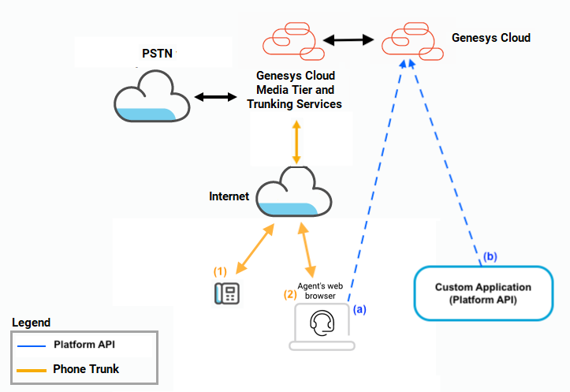
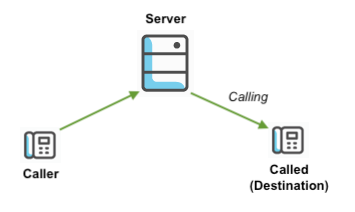
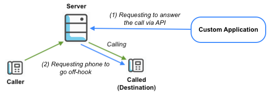
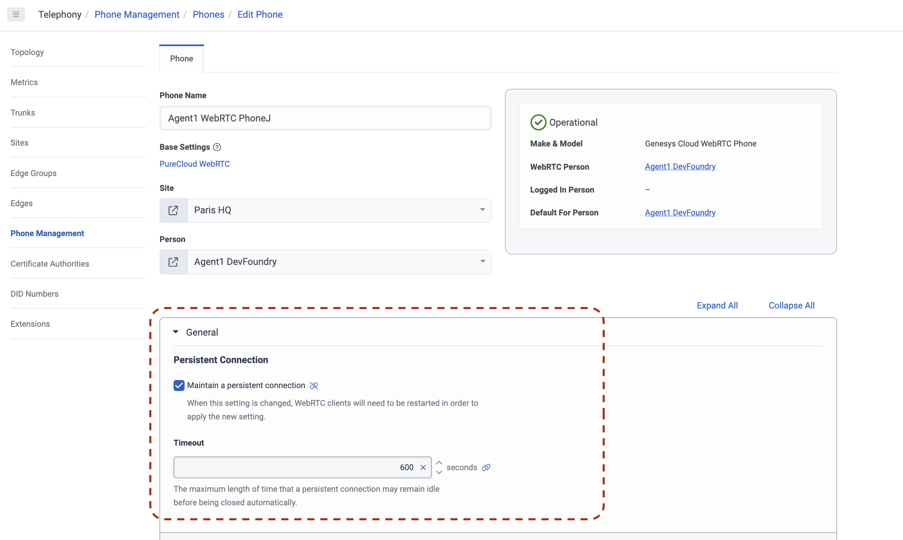
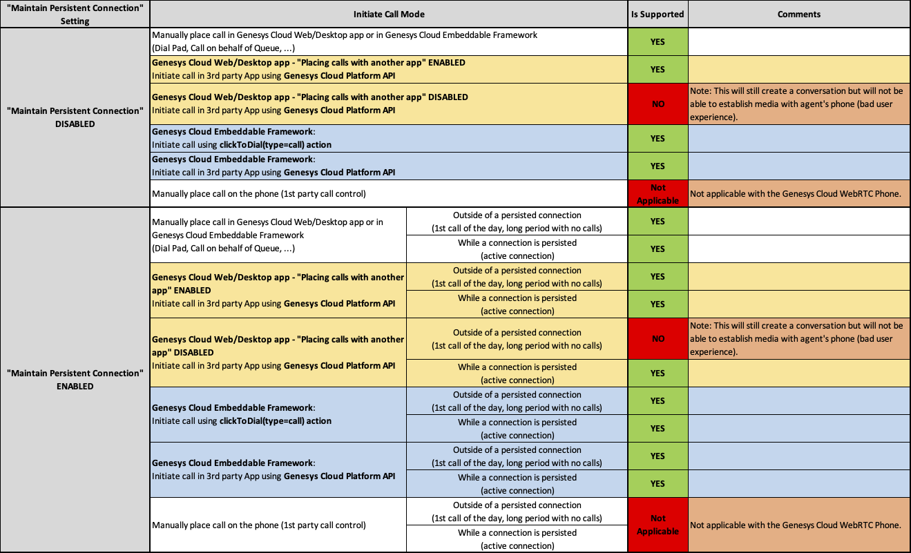
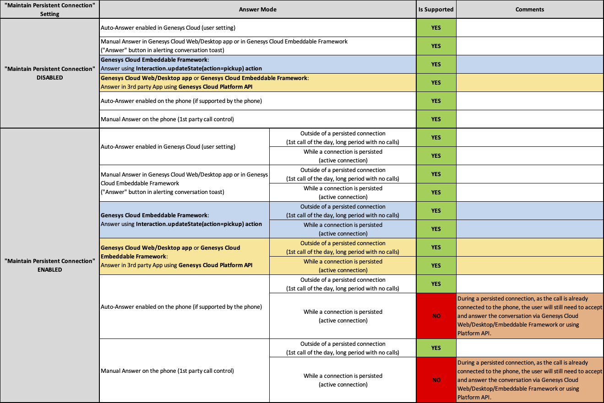
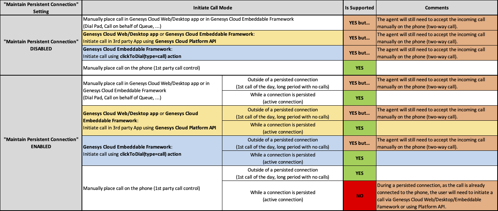

Greetings everyone! It had been a while since I posted an article.

Recently, as these questions were periodically popping up on the Genesys Cloud Developer forum, I have thought that it would be good to clarify *what we exactly support and what happens when trying to answer a voice call using the Platform API* (same when initiating a voice call using the Platform API).



## What's available in the Platform API?

***Request Answer Call:*** There are Platform API endpoints which purpose is to request a call to be connected (i.e. answered):
- [PATCH /api/v2/conversations/calls/{conversationId}/participants/{participantId}](/devapps/api-explorer#patch-api-v2-conversations-calls--conversationId--participants--participantId-) with `"state": "connected"`, while the conversation is alerting (*i.e. ringing*) at the Contact Center Agent's level.  
*participantId* refers to the agent (agent's participant) receiving this conversation.
- [PATCH /api/v2/conversations/{conversationId}/participants/{participantId}](/devapps/api-explorer#patch-api-v2-conversations--conversationId--participants--participantId-) with `"state": "connected"` can also be used for the same purpose.

***Request Make Call:*** There are Platform API endpoints which purpose is to request a call to be initiated (i.e. dialing):
- [POST /api/v2/conversations/calls](/devapps/api-explorer#post-api-v2-conversations-calls) to create a call conversation between the Contact Center Agent and another participant (another user, an ACD Queue, an external number).
- [POST /api/v2/conversations/calls/{conversationId}](/devapps/api-explorer#post-api-v2-conversations-calls--conversationId-) to place a new call as part of a callback conversation.

:::{"alert":"warning","autoCollapse":false}
**Note:** The fact that an API endpoint exists (e.g. to request a call to be answered) doesn't automatically imply that this request will be processed successfully in all possible scenario (e.g. with a remote phone). This will be described in more details later in this article.
:::

## Factors influencing Answer Call and Make Call via Platform API

One important thing to understand is that there are different factors which influence how and if calls can be answered or initiated via Platform API:
1. the type of [OAuth 2 Authorization Grant flow](/authorization/platform-auth/#authorization-types) which will be used to request an access token (for the Platform API requests). You'll need to [create the corresponding OAuth client](https://help.mypurecloud.com/?p=188023) in the Genesys Cloud configuration.
2. the type of phone used by the Contact Center Agent: [Genesys Cloud WebRTC Phone, Managed Phone (SIP), Remote Phone, Unmanaged Phone (Generic SIP)](https://help.mypurecloud.com/?p=76409)
3. for Unmanaged Phones (Generic SIP), if the phones support Broadsoft Extensions SIP Event Package for remote talk/hold (*SIP NOTIFY - Event: talk/hold*).
4. if the phone is configured to [maintain a Persistent Connection (Genesys Cloud feature)](https://help.mypurecloud.com/?p=134672) or not.


**OAuth Authorization Type:**

Why is it important?

Because **only the user** who is associated with the phone (the phone receiving the call) can invoke the Platform API Answer Call or Make Call.

:::{"alert":"primary","title":"User oriented token","autoCollapse":false}
What does that imply?  
The access token, used in the Platform API request, must be obtained via an [Implicit Grant, Authorization Code Grant, PKCE Code Grant or SAML2 Bearer Grant flow](/authorization/platform-auth/#authorization-types).  
**The access (bearer) token MUST be associated with the user receiving the call or making the call** (the token must correspond to a user who is an active participant in this conversation).
:::

:::{"alert":"warning","autoCollapse":false}
It is not possible to invoke these Platform API endpoints using a OAuth Client Credentials Grant token.  
Invoking the Platform API Answer Call and Make Call will result in an HTTP Error (400).
:::

**Phone Type:**

Why does the phone type matter?

This is because answering a call remotely is not something trivial and is not supported by design and by default on all phones and on all types of networks (PSTN/PLMN, SIP).

Let's imagine a call initiated by an external participant (the caller), to a destination's phone (the called party), and whose signaling (at least) is exchanged via an intermediate server (in our case, it would be Genesys Cloud).



The following is just theoretical.  
Requesting to answer a call via an API would then translate in two possible approaches:

1. Interacting with the phone directly (if it exposes any sort of API).


Somehow, headsets could fall in this category. The headset interacts with the phone, so a call can be answered or released using headset buttons or SDKs.

2. Interacting with the server.



The server would then need to interact with the phone to request it to go off-hook  (i.e. 3rd party call control).

This sounds great in principle. But that doesn’t mean it is implemented and possible with all type of phones.  
So beyond theory, how would this work with Genesys Cloud?

When it comes to SIP Phones, Genesys Cloud supports the Broadsoft Extensions SIP Event Package for remote talk/hold.

**Answer Call:**  


A phone can advertise support for remote answer in the 180 Ringing, adding "Allow-Events: talk" header.
If a custom application requests the server to answer the call, the server will request the phone to go off-hook sending a SIP NOTIFY with "Event: talk" header.  
***The Genesys Cloud Managed Phones support the Broadsoft Extensions for remote talk.***

**Make Call:**  


When requesting to create a two-way call, the server will create a leg to the agent's phone first, sending a SIP NOTIFY with "Event: talk" automatically on 180 Ringing.

:::{"alert":"primary","autoCollapse":false}
Genesys Cloud WebRTC Phone is a specific case. WebRTC does not include and define a protocol for the management of sessions (to create, maintain or terminate a session between users).
The approach for answering call via API will be a combination of interacting with the phone directly (as it is embedded in Genesys Cloud Desktop) and with the server.
:::


**Maintain Persistent Connection:**

The ability to [maintain a persistent connection](https://help.mypurecloud.com/articles/terminate-persistent-connection-genesys-cloud-webrtc-phone/) is a Genesys Cloud feature that can be enabled at the phone (or phone base setttings) level.



*"The persistent connection feature is designed to improve Genesys Cloud’s ability to process subsequent calls. More specifically, when a call comes in to an agent, Genesys Cloud establishes a connection to the agent’s Genesys Cloud WebRTC phone and then passes the call to the agent. Once the call is complete and the agent hangs up, Genesys Cloud terminates the call, but leaves the connection to the agent’s WebRTC phone intact."*


What it means is that the agent's phone remains connected to Genesys Cloud once the call with the customer is completed -> when the agent requests to end the conversation via Genesys Cloud Desktop or Platform API, when the customer hangs up.  
From a Platform API perspective, there is no active "conversation (if the logged in user invokes [GET /api/v2/conversations](/devapps/api-explorer#get-api-v2-conversations), no Genesys Cloud conversation context will be returned). But from a telephony standpoint, there is still an active call/session between Genesys Cloud and the agent's phone.


## By Phone Type and settings

The tables presented below describe what happens when Platform API is used but also what happens with other mode of answer (e.g. answer in Genesys Cloud Desktop, answer on the phone, [Auto-Answer enabled for the agent (Genesys Cloud feature)](https://help.mypurecloud.com/?p=84007), ...).

### With Genesys Cloud WebRTC Phones

#### Answer Call


#### Make Call

:::{"alert":"warning","autoCollapse":false}
***When using the Genesys Cloud WebRTC Phone*** and initiating a call via Platform API (from a custom application), it is required to [allow the user to place calls with another app](https://help.mypurecloud.com/articles/allow-apps-to-place-calls/).  
:::


This setting is not managed centrally using the Genesys Cloud Admin UI. Each user must enable this setting from his Genesys Cloud Desktop.  
Please also note that the setting is saved in browser's cookies. It will remain set (until/unless the cookie expire or is removed).




:::{"alert":"primary","autoCollapse":false}
As described in the Answer Call section above, there is a limitation when requesting to answer a call using Genesys Cloud Platform API and when there is no active persisted connection.  
In order to force the user to be in a persistent connection, a 3rd party application could periodically initiate a call (Platform API request to make a call) to a device, which would automatically disconnect this call.
:::

As an example: defining an Architect Inbound Call flow (e.g. named "ForceDisconnect") with just a short silence and a Disconnect action in it.


And periodically initiating calls to *ForceDisconnect@localhost* (the call will automatically be disconnect by the Architect flow - as it is a non-ACD call, wraup-up code do not need to be set to terminate the conversation), using [POST /api/v2/conversations/calls](/devapps/api-explorer#post-api-v2-conversations-calls)

```{"language": "json"}
POST /api/v2/conversations/calls
{
    "phoneNumber":"ForceDisconnect@localhost"
}
```


### With Managed Phones (SIP)

#### Answer Call



#### Make Call


### With Remote Phones

#### Answer Call


#### Make Call


### With Generic SIP Phone (Unmanaged) supporting of Broadsoft Extensions

#### Answer Call


#### Make Call


### With Generic SIP Phone (Unmanaged)

#### Answer Call


#### Make Call




## In Summary

***With Genesys Cloud WebRTC Phone:***

The following settings are required to support answering a call or placing a call using Platform API:
- Enable "Maintain Persistent Connection" at phone or phone base settings level (Genesys Cloud centralized configuration)
- Allow "Placing calls with another app" (Genesys Cloud Desktop - local/cookie setting)
- Periodically generate calls (it can be to a destination that will disconnect almost immediately - e.g. an Architect Inbound Call flow) to maintain a persistent connection active.

***With Managed Phone and Generic SIP Phone (with broadsoft extensions support):***

Answering a call or placing a call using Platform API **is fully supported**, regardless of the setting to "Maintain Persistent Connection" (supported in both cases).

***With Remote Phone and Generic SIP Phone (no remote answer support):***

Answering a call using Platform API **is not supported**.  
Placing a call using Platform API is supported but will require the agent to manually answer the incoming call on the phone (Two-way call generated from Genesys Cloud).


## Closing Thoughts

You should now have the necessary information to understand when a call can be answered or initiated using the Platform API, and when it is not possible.

Thank you and have fun!

